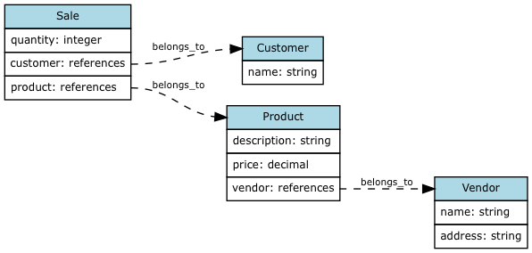

# Documentação Principal

Esta é a documentação de mais alto nível sobre a aplicação `sales-app`. Ela
explica em linhas gerais como a aplicação foi desenvolvida e como funciona,
apontando para documentos mais detalhados.

## Especificação

A `sales-app` é uma aplicação Rails simples de controle de vendas. Ela oferece
para o usuário um formulário de *upload* de arquivo através do qual deve ser
submetido um arquivo de texto contendo dados de vendas de uma empresa fictícia.

Feita a submissão do arquivo, os dados nele contidos devem ser normalizados e
salvos no banco de dados. Feito isto, será exibida uma tela que resume a
submissão, onde os dados submetidos são exibidos em forma de tabela, com a
receita bruta total desses registros contabilizada.

Deve haver também uma tela que exibe **todos** os registros de vendas contidos
no banco de dados, também no formato de tabela e com a receita bruta total
contabilizada.

### Casos de uso

A aplicação possui quatro telas:

1. **Boas Vindas**: a tela inicial da aplicação, que aparece quando o usuário
   acessa sua URL raiz. Possui um pequeno texto que descreve a aplicação.
2. **Upload de Arquivo**: formulário de submissão de arquivo de dados.
3. **Dados Importados**: tela de resposta à submissão dos dados, mostra numa
   tabela os dados de vendas que foram importados e a receita bruta total
   dessas vendas.
4. **Vendas Realizadas**: mostra em uma tabela **todas** as vendas presentes no
   banco de dados, e também a receita bruta total delas.

Todas as telas possuem sempre visíveis, em uma barra de navegação, três links:

1. **Home**, que leva para a página de **Boas Vindas**
2. **Upload**, que leva para a página de **Upload de Arquivo**
3. **Vendas**, que leva para a página de **Vendas Realizadas**

Além disso, a tela de **Upload de Arquivo** possui um formulário de submissão
de arquivo com um botão **Submeter**, que leva para a página de **Dados
Importados**.

Sendo assim, são 4 as transições existentes entre as telas da aplicação:
**Home**, **Upload**, **Vendas** e **Submeter**. Todos os fluxos possíveis
podem ser visualizados no diagrama abaixo:


### Formato de Arquivo

O formato de arquivo a ser submetido é um arquivo de texto com campos separados
por TAB e um registro por linha. Esse formato é conhecido por [TSV] -- ***Tab
Separated Values***.

Além disso, uma peculiaridade do arquivo é que ele possui na sua primeira linha
os nomes das colunas, isto é, o arquivo possui um *header* ou cabeçalho. Os
nomes das colunas são os seguintes:

1. **Comprador**
2. **Descrição**
3. **Preço Unitário**
4. **Quantidade**
5. **Endereço**
6. **Fornecedor**

Os nomes das colunas aparecem sempre na ordem apresentada acima; porém, para a
aplicação, este detalhe não é importante pois ela se orienta pelos nomes das
colunas.

## Implementação

Nesta seção serão discutidas as decisões de projeto relacionadas à
implementação da aplicação.

### Banco de Dados e Normalização

Um dos requisitos da aplicação é que os dados sejam persistidos no banco de
dados de forma normalizada.

Porém, o enunciado do desafio não definiu como essa normalização deve ser
feita, sendo então necessário especificá-la aqui.

A normalização realizada parte dos seguintes pressupostos:

* O comprador é definido unicamente pelo seu nome que aparece na coluna
  **Comprador**. Isto significa que, por exemplo, toda vez que aparecer o nome
  `Amy Pond` nesta coluna, ele se refere sempre à mesma pessoa.
* A coluna **Descrição** contém uma descrição textual de um produto ou serviço
  sendo vendido. Portanto, sempre que um mesmo texto ocorrer nesta coluna (por
  exemplo, `R$20 Sneakers for R$5`), ele se refere ao mesmo produto.
* A coluna **Preço Unitário** é uma propriedade do produto.
* A coluna **Quantidade** é uma propriedade da venda.
* O fornecedor tem seu nome dado pela coluna **Fornecedor**.
* O endereço apresentado na coluna **Endereço** é uma propriedade do
  fornecedor.
* O fornecedor é definido pela combinação única de seu nome e endereço.
* O fornecedor é uma propriedade do produto.
* O produto é definido pela combinação única de sua descrição e seu fornecedor.

Dadas essas considerações, o banco de dados pode então ser modelado através da
criação de 4 modelos do Rails:

* `Customer`: comprador.
* `Vendor`: fornecedor.
* `Product`: produto.
* `Sale`: venda.

Esses quatro modelos possuem seus atributos e relacionamentos explicitados no
diagrama abaixo:



**Nota**: os modelos foram criados com nomes em inglês pois o código está todo
em inglês.

Esses modelos foram todos criados com os seguintes comandos `rails`:

```console
rails g model Customer name:string:uniq
rails g model Vendor name:string address:string
rails g model Product description:string price:decimal vendor:references
rails g model Sale customer:references product:references quantity:integer
```

### Processamento do arquivo

O processamento do arquivo submetido é realizado da seguinte forma:

1. **Parsing**: o *parsing* do arquivo é realizado através da classe [CSV]
   nativa de Ruby. Como o arquivo tem separação de campos por TABs e não por
   vírgulas, basta configurar o parâmetro `col_sep` para TABs.

   Além disso, como o arquivo possui nomes de colunas em português, com acentos
   e espaços (`"Preço Unitário"`), ao fazer o *parsing* do arquivo utilizaremos
   um conversor de *headers* customizado (`HeaderConverter`) que transforma os
   nomes em português para nomes simplificados em inglês, que são muito mais
   fáceis de se utilizar no código.

   Segue abaixo a tabela de conversões:

   | Original         | Conversão em Inglês |
   |------------------|---------------------|
   | `Comprador`      |         `:customer` |
   | `Descrição`      |      `:description` |
   | `Preço Unitário` |            `:price` |
   | `Quantidade`     |         `:quantity` |
   | `Endereço`       |          `:address` |
   | `Fornecedor`     |           `:vendor` |

2. **Persistência no Banco de Dados**: cada linha do arquivo deve gerar uma
   nova entrada na tabela de vendas (um novo objeto `Sale`). Porém, antes disso
   é preciso verificar se o comprador (`Customer`), o fornecedor (`Vendor`) e o
   produto (`Product`) já existem no banco de dados e, caso não existam, devem
   ser criadas entradas novas correspondentes a eles.

   A operação de criação dos objetos relacionados se faz com o método
   [`find_or_create_by`] de Rails, que encontra um objeto com as
   características informadas ou então cria um novo caso não exista. Porém,
   esse método não é atômico, o que pode fazer com que uma inserção de dados
   falhe devido a uma restrição de unicidade (*unique constraint*). Para
   resolver esse caso, fazemos a inserção [como sugere a documentação do
   Rails][`find_or_create_by`], repetindo a operação de `find_or_create_by`,
   que agora deverá simplesmente retornar o objeto já existente no banco de
   dados.

   Para evitar a repetição de código do *retry*, implementamos esse código em
   uma [*Concern*] chamada `Retriable`, dentro de um método
   `find_or_create_by_retry`, que podemos então usar tranquilamente no código
   dos modelos.

   Finalmente, é preciso notar que a inserção dos dados de um arquivo deve ser
   feita de forma **transacional**, isto é, se a inserção de algum registro do
   arquivo falhar por algum motivo, nenhum registro dessa operação terá sido
   inserido ([*rollback*] da transação).

3. **Resultado**: os registros de vendas inseridos no banco de dados são
   retornados pela operação de inserção e devem então ser formatados sob a
   forma de uma tabela para exibição para o usuário, confirmando a ele que os
   registros do arquivo foram inseridos com sucesso.

### Rotas e *controllers*

A aplicação é implementada utilizando-se apenas 2 *controllers* de Rails:

1. `welcome` que é trivial: sua única ação `index` tem como função exibir a
   capa ("home") da aplicação (rota `/`)
2. `sales` que permite trabalhar com dados de vendas. Possui 3 rotas:
  1. `/sales` (action `sales#index`): exibe todas as vendas do banco de dados.
  2. `/sales/upload` (action `sales#upload`): exibe o formulário de submissão
     de arquivo.
  3. `/sales/import` (action `sales#import`): endereço onde é postado o arquivo
     de dados (verbo `POST`); retorna uma visão com os dados submetidos.

Os *controllers* para esta aplicação foram gerados a partir dos seguintes
comandos `rails`:

```console
rails g controller Welcome index
rails g controller Sales index upload import
```

[TSV]: https://en.wikipedia.org/wiki/Tab-separated_values
[CSV]: https://docs.ruby-lang.org/en/2.4.0/CSV.html
[`find_or_create_by`]: http://api.rubyonrails.org/classes/ActiveRecord/Relation.html#method-i-find_or_create_by
[*Concern*]: http://api.rubyonrails.org/classes/ActiveSupport/Concern.html
[*rollback*]: https://en.wikipedia.org/wiki/Rollback_(data_management)
