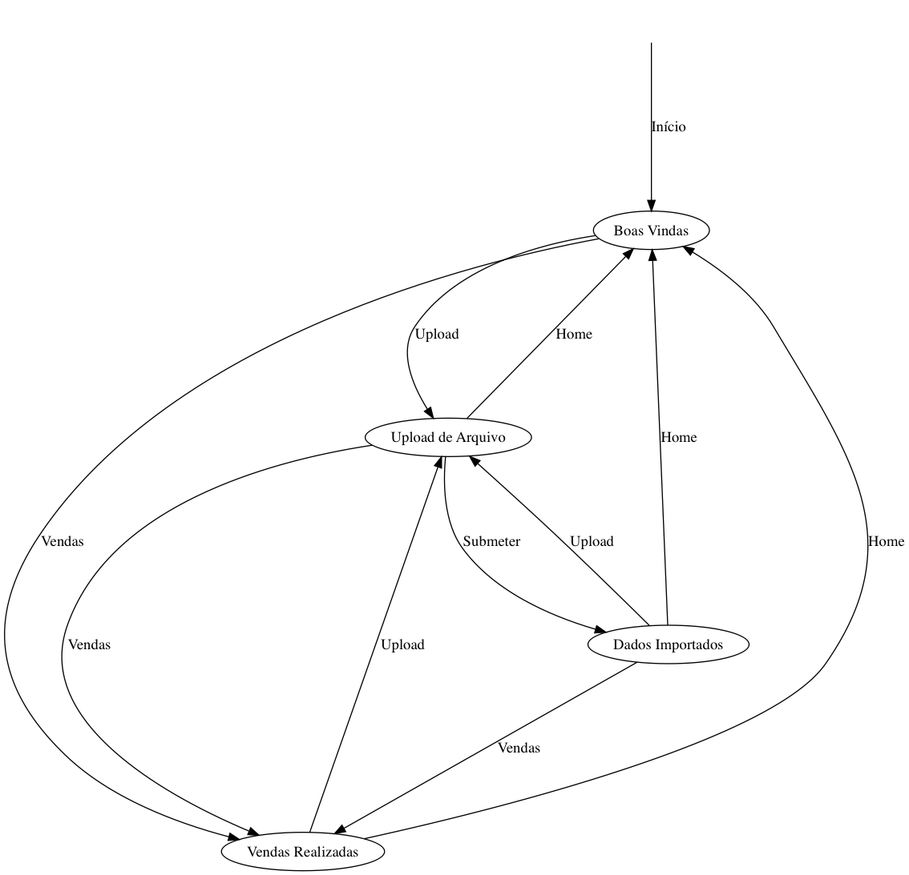

# Documentação Principal

Esta é a documentação de mais alto nível sobre a aplicação `sales-app`. Ela
explica em linhas gerais como a aplicação foi desenvolvida e como funciona,
apontando para documentos mais detalhados.

## Especificação

A `sales-app` é uma aplicação Rails simples de controle de vendas. Ela oferece
para o usuário um formulário de *upload* de arquivo através do qual deve ser
submetido um arquivo de texto contendo dados de vendas de uma empresa fictícia.

Feita a submissão do arquivo, os dados nele contidos devem ser normalizados e
salvos no banco de dados. Feito isto, será exibida uma tela que resume a
submissão, onde os dados submetidos são exibidos em forma de tabela, com a
receita bruta total desses registros contabilizada.

Deve haver também uma tela que exibe **todos** os registros de vendas contidos
no banco de dados, também no formato de tabela e com a receita bruta total
contabilizada.

### Casos de uso

A aplicação possui quatro telas:

1. **Boas Vindas**: a tela inicial da aplicação, que aparece quando o usuário
   acessa sua URL raiz. Possui um pequeno texto que descreve a aplicação.
2. **Upload de Arquivo**: formulário de submissão de arquivo de dados.
3. **Dados Importados**: tela de resposta à submissão dos dados, mostra numa
   tabela os dados de vendas que foram importados e a receita bruta total
   dessas vendas.
4. **Vendas Realizadas**: mostra em uma tabela **todas** as vendas presentes no
   banco de dados, e também a receita bruta total delas.

Todas as telas possuem sempre visíveis, em uma barra de navegação, três links:

1. **Home**, que leva para a página de **Boas Vindas**
2. **Upload**, que leva para a página de **Upload de Arquivo**
3. **Vendas**, que leva para a página de **Vendas Realizadas**

Além disso, a tela de **Upload de Arquivo** possui um formulário de submissão
de arquivo com um botão **Submeter**, que leva para a página de **Dados
Importados**.

Sendo assim, são 4 as transições existentes entre as telas da aplicação:
**Home**, **Upload**, **Vendas** e **Submeter**. Todos os fluxos possíveis
podem ser visualizados no diagrama abaixo:

### Formato de Arquivo

O formato de arquivo a ser submetido é um arquivo de texto com campos separados
por TAB e um registro por linha. Esse formato é conhecido por [TSV] -- ***Tab
Separated Values***.

Além disso, uma peculiaridade do arquivo é que ele possui na sua primeira linha
os nomes das colunas, isto é, o arquivo possui um *header* ou cabeçalho. Os
nomes das colunas são os seguintes:

1. **Comprador**
2. **Descrição**
3. **Preço Unitário**
4. **Quantidade**
5. **Endereço**
6. **Fornecedor**

Os nomes das colunas aparecem sempre na ordem apresentada acima; porém, para a
aplicação, este detalhe não é importante pois ela se orienta pelos nomes das
colunas.

[TSV]: https://en.wikipedia.org/wiki/Tab-separated_values
